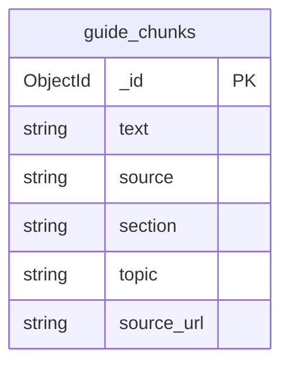

# Entity Document Diagram

This app uses a single MongoDB collection in the `citizenship_app` database.

## Entity: guide_chunks

Chunks of the ingested MongoDB study guides. Each document represents one retrieval-sized window of text drawn from a markdown source file, tagged with its topic and nearest heading.

### Fields

| Name | Type | Required | Description |
|------|------|----------|-------------|
| `_id` | ObjectId | yes | Primary key, auto-generated |
| `text` | string | yes | Chunk body (the retrieval unit; also the field that Atlas auto-embeds) |
| `source` | string | yes | Source markdown filename (e.g. `indexes.md`) |
| `section` | string | yes | Nearest markdown heading above the chunk |
| `topic` | string | yes | Display name from `topics.json` |
| `source_url` | string \| null | no | Canonical MongoDB docs URL for the source, if known |

### Indexes

- `guide_chunks_vector` — Atlas Vector Search index on `text` with automated embedding. Used by the `$vectorSearch` stage.
- `guide_chunks_text` — Atlas Search index with static mappings: `text` (type `string`) and `topic` (type `token`). Used by the `$search` stage and topic filters. Auto-created on server startup.

### Relationships

None. Single-collection application.

### Diagram

