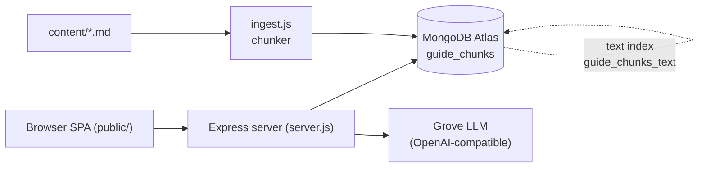

# MongoDB Skill Badge Study Buddy

An interactive learning hub that helps engineers prep for MongoDB skill badges using hybrid semantic + keyword retrieval over the official docs.
Built on MongoDB Atlas ($rankFusion, Vector Search, Atlas Search) with an OpenAI-compatible LLM.

## Capabilities

- Guided per-topic learning paths generated from ingested docs
- Per-topic 10-question quizzes (mixed multiple choice + free text) with auto-grading
- General Ask box grounded in retrieved chunks with citations
- Hybrid semantic + keyword retrieval combined via `$rankFusion`
- Developer view showing vector, keyword, and fusion scores side-by-side
- Session-tracked progress with completion checkmarks per topic
- "Build Your Own" guide describing how to reproduce the app

## Architecture Overview

The browser SPA (vanilla JS) calls a small Express API. The server issues a single aggregation to MongoDB Atlas that runs vector search and Atlas Search full-text in parallel and merges results with `$rankFusion`. Retrieved chunks are handed to the Grove LLM (OpenAI-compatible) as grounded context.

Ingestion is a separate script: markdown files in `content/` are split by heading, chunked into overlapping windows, and inserted into MongoDB. Atlas automatically embeds the `text` field via the vector index's auto-embedding configuration.



## Quick Start

```bash
git clone https://github.com/murrayhu-mdb/mongodb-skill-badge-study-buddy.git
cd mongodb-skill-badge-study-buddy
npm install
```

Create a `.env` file:

```bash
MONGODB_URI="mongodb+srv://<user>:<pass>@<cluster>/"
DB_NAME="citizenship_app"
VECTOR_INDEX="guide_chunks_vector"
TEXT_INDEX="guide_chunks_text"
EMBEDDING_PATH="text"
GROVE_API_KEY="..."
GROVE_BASE_URL="https://.../v1"
GROVE_MODEL="..."
```

Load content and start the server:

```bash
node ingest.js
node server.js
# open http://localhost:3000
```

The Atlas Search text index is auto-created on server startup. The vector search index with auto-embedding must be created manually in the Atlas UI on the `guide_chunks` collection with path `text`. See [Atlas Vector Search auto-embedding](https://www.mongodb.com/docs/atlas/atlas-vector-search/automated-embedding/).

## MongoDB features demonstrated

- [Atlas Vector Search](https://www.mongodb.com/docs/atlas/atlas-vector-search/vector-search-overview/) - semantic retrieval, `server.js:96` (`$vectorSearch` stage)
- [Atlas Search (full-text)](https://www.mongodb.com/docs/atlas/atlas-search/atlas-search-overview/) - lexical retrieval, `server.js:107` (`$search` stage)
- [$rankFusion hybrid retrieval](https://www.mongodb.com/docs/manual/reference/operator/aggregation/rankFusion/) - reciprocal-rank fusion in one pipeline, `server.js:91`
- [Automated embedding](https://www.mongodb.com/docs/atlas/atlas-vector-search/automated-embedding/) - configured on the vector index; ingest inserts plain text at `ingest.js:101`
- [Programmatic Atlas Search index management](https://www.mongodb.com/docs/manual/reference/method/db.collection.createSearchIndex/) - `createSearchIndex` at `server.js:40`
- [Aggregation pipeline](https://www.mongodb.com/docs/manual/core/aggregation-pipeline/) - the retrieval and debug pipelines in `server.js`

## Why MongoDB?

- One database stores structured chunk metadata (topic, section, source, source_url) and the vector embeddings — no separate vector store to keep in sync.
- Hybrid retrieval runs in a single aggregation via `$rankFusion`, so there is no external reranker or fan-out orchestration in application code.
- The Atlas Search text index is created programmatically at server startup via the Node driver's `createSearchIndex`, so a fresh cluster becomes queryable without manual UI steps.
- Automated embedding on the vector index means the ingest pipeline just writes text; the embedding model runs inside Atlas.
- The document model naturally fits variable-length chunks with heterogeneous section/topic metadata — no schema migrations when new topics are added.
- The dev-mode debug endpoint uses the same collection to compare vector, keyword, and fusion scores side-by-side, which would require three systems in a bolt-together stack.

## Additional resources

- [MongoDB skill badges catalog](https://learn.mongodb.com/skills)
- [MongoDB Atlas](https://cloud.mongodb.com)
